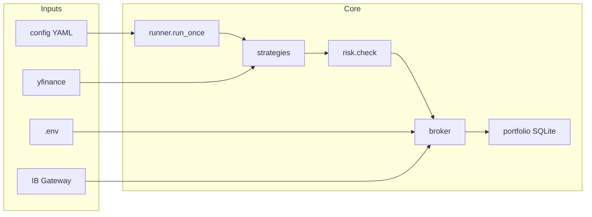

# Architecture

## High-level flow

1. **`main.py --once`** loads config, connects the broker, and for each enabled bot calls **`runner.run_bot`**.
2. **`run_bot`** pulls historical bars (`analysis.market_data`), builds a **`PortfolioSnapshot`** from SQLite, runs the strategy’s **`propose_orders`**, then **`executor.run_orders`** (risk → broker fill → `portfolio.apply_fill`).
3. **`MockBroker`** simulates fills in EUR; **`IBKRBroker`** sends real paper orders using contracts from **`data/contracts.json`** (built by `scripts/resolve_contracts.py`).

## Bot 1 (ETF momentum)

- **Module:** `strategies/etf_momentum.py`
- **Universe:** `config/watchlists.yaml` → `etfs_ucits`
- **Signal:** 63-trading-day total return rank; hold top 3 equal-weight; optional trend filter (all top-3 negative → cash).
- **Calendar:** Rebalances on **Monday** by default. **`--force-rebalance`** skips that gate for manual or weekend runs; **`--as-of`** truncates bars to a given date (e.g. Friday close on Saturday).

## Virtual book vs IBKR

Each bot has a **€1,000 virtual ledger** in SQLite. Orders may execute in a **shared IBKR paper account**. The bot’s P&amp;L is derived from the virtual book, not from reconciling IBKR’s global cash. Resetting the virtual book (`main.py --reset-virtual-book`) does **not** flatten open positions at the broker.

## Risk layer

All proposed orders pass through **`core/risk.py`** (position caps, floor, daily trade count, fee-aware skip). See `README.md` and `tests/test_risk.py`.

## Extension points

- Register new strategies in **`core/runner.py`** → `STRATEGY_REGISTRY`.
- Add tickers in **`config/watchlists.yaml`** and re-run **`scripts/resolve_contracts.py`** before IBKR trading.
